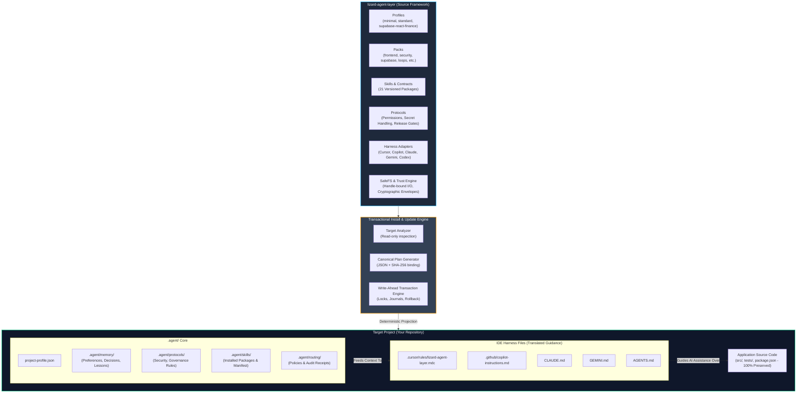
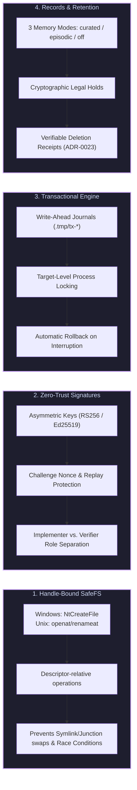
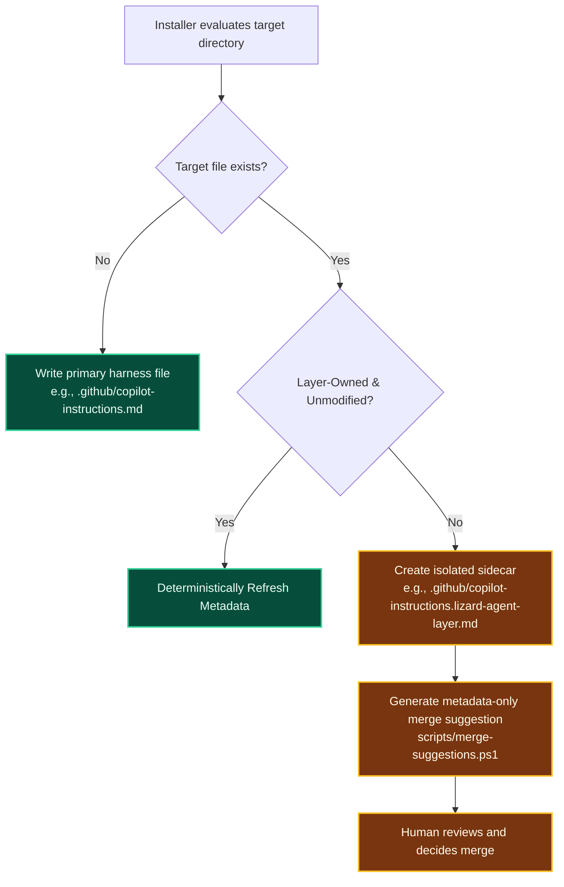
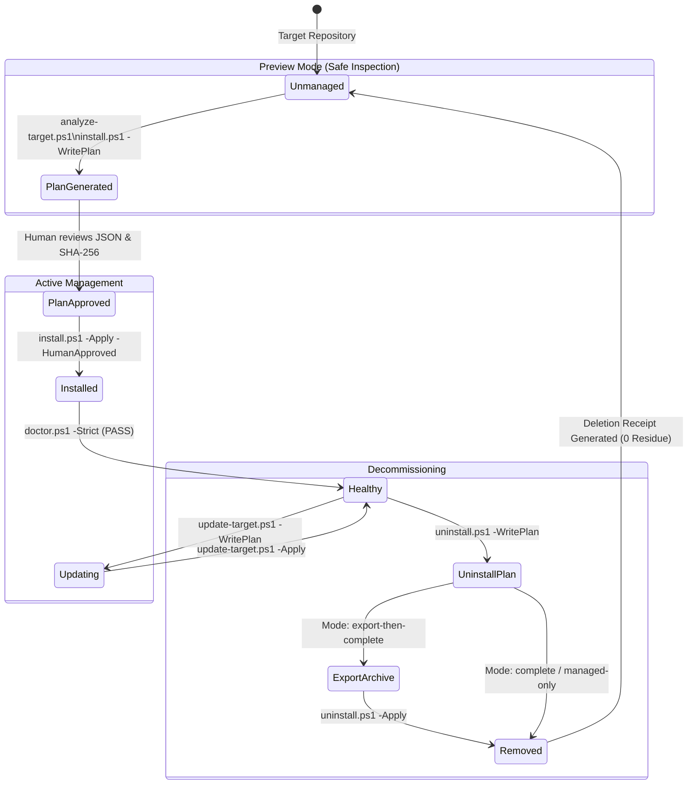

# Visual Architecture & Systems Blueprint

> **lizard-agent-layer** is a vendor-neutral, portable governance and execution infrastructure for AI coding agents. It overlays standard development environments with strict security, deterministic workflows, long-term memory, and cryptographic verification.

---

## 1. High-Level System Topology

The system maintains a strict boundary between the **Reusable Source Layer** and the **Target Projects**:



---

## 2. The 4 Security & Governance Pillars



---

## 3. Staged Execution & Anti-Hallucination Pipeline

Every AI interaction in a project configured with `lizard-agent-layer` follows the **10-80-10 Staged Execution Pipeline** to prevent impulsive or unsafe code changes:

```mermaid
sequenceDiagram
    autonumber
    actor Dev as Developer / User
    participant AI as AI Coding Agent (Cursor / Copilot / Claude)
    participant Core as .agent/ Governance Core
    participant Guard as Secret & Path Guard
    participant Verifier as Constrained Verifier
    participant Memory as .agent/memory/

    Dev->>AI: "Implement feature / Fix bug"
    AI->>Core: Read project-profile, protocols & skills
    AI->>Memory: Consult DECISIONS.md & LESSONS.md
    
    rect rgb(30, 41, 59)
        note over AI,Guard: STAGE 1: Clarify & Plan (10% Token Budget)
        AI->>AI: Analyze existing architecture & types
        AI->>Dev: Propose structured, reviewable plan
    end
    
    Dev-->>AI: Plan Approved
    
    rect rgb(15, 23, 42)
        note over AI,Guard: STAGE 2: Execute with Constraints (80% Token Budget)
        AI->>Guard: Validate file paths & secret boundaries
        Guard-->>AI: Access authorized (Handle-bound SafeFS)
        AI->>AI: Make modular code edits
    end

    rect rgb(30, 41, 59)
        note over AI,Verifier: STAGE 3: Independent Verification (10% Token Budget)
        AI->>Verifier: Run test suites & linter
        Verifier-->>AI: Verification Evidence (PASS / FAIL)
        AI->>Memory: Record new lessons / decisions (if applicable)
        AI->>Dev: Present verified results with proof
    end
```



---

## 4. Multi-Harness Adapter & Non-Clobbering Sidecar Architecture

When `lizard-agent-layer` is installed in a repository with existing configuration files, it **never overwrites** developer files without explicit force. It deploys sidecars and merge guidance:



---

## 5. Lifecycle State Machine: Install, Update & Uninstall



---

## 6. Directory Structure & File Map Reference

```text
lizard-agent-layer/
├── adapters/                  # Harness shims (Cursor, Copilot, Claude, Gemini, Codex)
├── changes/                   # Versioned change records linking ADRs to path impacts
├── docs/
│   ├── adr/                   # 23 Architecture Decision Records (ADR-0001 to ADR-0023)
│   ├── audits/                # Static security audits & remediation ledgers
│   ├── getting-started.md     # Comprehensive 6-section operations guide
│   └── visual-architecture.md # This visual architecture document
├── packages/ / packs/         # Reusable feature packs (frontend, supabase, security, etc.)
├── profiles/                  # Pre-configured project shapes (minimal, standard, finance)
├── protocols/                 # Shared governance rules (secrets, release gates, handoff)
├── registry/                  # Contracts, quality rubrics, and drift baselines
├── retention-policies/        # Records retention and legal hold policies
├── routing-policies/          # Staged model routing and fallback policies
├── schemas/                   # 25+ JSON Schema contracts (Draft 2020-12)
├── scripts/
│   ├── native/                # C# P/Invoke SafeFS backends (Windows/Unix handles)
│   ├── Lizard.*.psm1          # Core PowerShell modules (SafeFs, Trust, Plan, Records, etc.)
│   ├── install.ps1            # Transactional target installer
│   ├── update-target.ps1      # Drift-aware target updater
│   ├── uninstall.ps1          # Cryptographically verified uninstaller
│   └── doctor.ps1             # Strict health & integrity validator
├── skills/                    # 21 Reusable skill packages with skill.json metadata
├── templates/                 # Target project seeds & memory structures
└── tests/
    ├── adversarial/           # 14 Adversarial attack & tamper tests
    ├── integration/           # 16 End-to-end lifecycle integration tests
    ├── schema/                # Schema mutation and contract tests
    └── unit/                  # 13 Unit test suites for primitives
```

---

## 7. Summary: Why This Architecture Protects Your Team

1. **Zero Hallucination Leaks:** AI assistants cannot overwrite code or leak secrets because file mutations are checked against strict SafeFS boundaries.
2. **Zero Vendor Lock-In:** The same engineering standards work seamlessly across Cursor, Copilot, Claude Code, Codex, and Gemini.
3. **Audit-Ready Evidence:** Every model decision, loop run, and verification command produces cryptographically signed, replay-protected receipts.
4. **Idempotent & Reversible:** Every operation can be dry-run previewed, audited, safely updated, or completely removed with zero leftover residue.
